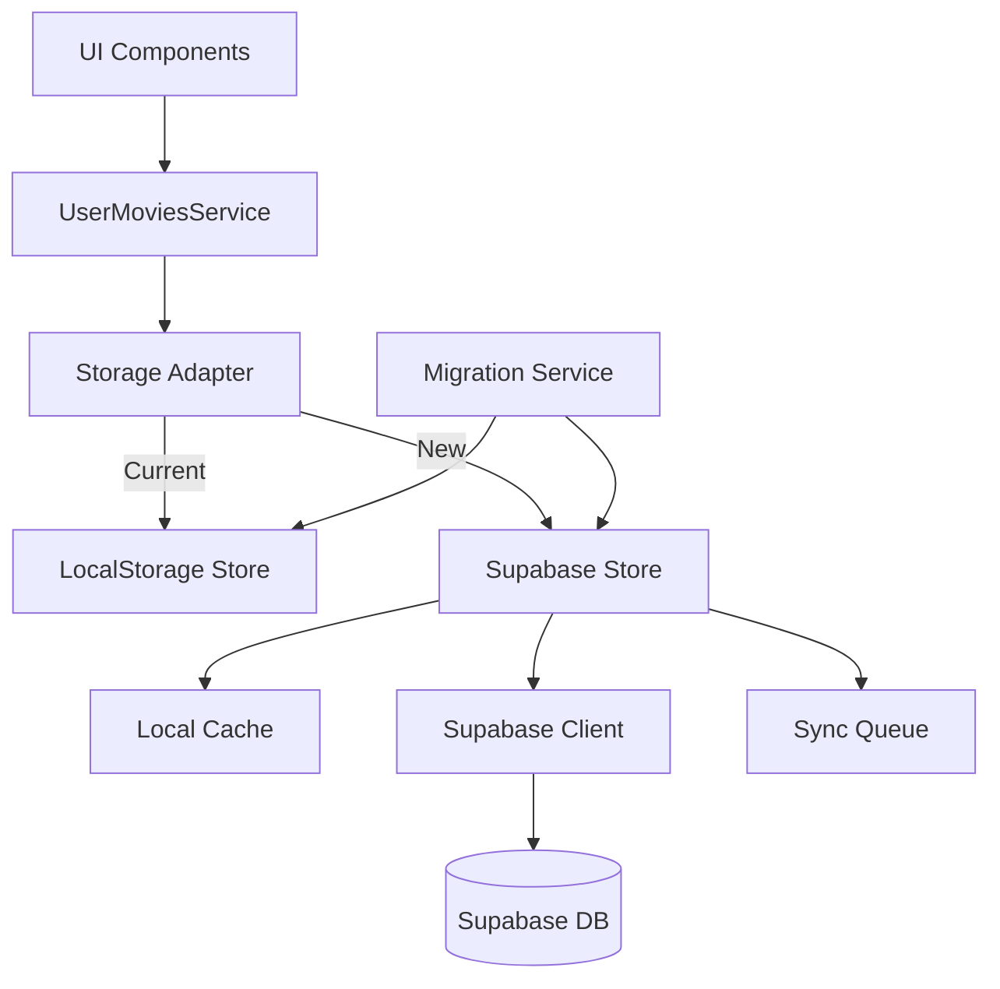

# Design Document: Migration to Supabase

## Overview

Данный документ описывает техническую архитектуру миграции системы хранения пользовательских данных с localStorage на Supabase. Решение обеспечивает облачное хранение данных с синхронизацией между устройствами, сохраняя при этом возможность работы в офлайн-режиме и быстрый отклик интерфейса.

### Key Design Principles

1. **Backward Compatibility** - сохранение существующего API для минимизации изменений в коде
2. **Offline-First** - приоритет локального кеша для быстрого отклика
3. **Gradual Migration** - поэтапный переход с возможностью отката
4. **Data Integrity** - гарантия сохранности данных при миграции
5. **Security** - защита данных пользователя через RLS

## Architecture

### High-Level Architecture



### Component Layers

1. **Service Layer** - `UserMoviesService` (без изменений)
2. **Adapter Layer** - `StorageAdapter` (новый, выбор хранилища)
3. **Storage Layer** - `LocalStorageStore` и `SupabaseStore`
4. **Migration Layer** - `MigrationService`
5. **Sync Layer** - `SyncService` (управление очередью синхронизации)

## Components and Interfaces

### 1. Storage Adapter Interface

Единый интерфейс для всех типов хранилищ:

```javascript
interface IStorageAdapter {
  // Movies
  getMovies(type: 'want' | 'watched' | 'watching'): Promise<Movie[]>
  addMovie(type: string, movie: Movie): Promise<void>
  removeMovie(type: string, movieId: number): Promise<void>
  
  // Episodes
  getEpisodeStatus(tvId: number, seasonNumber: number, episodeNumber: number): Promise<boolean>
  setEpisodeStatus(tvId: number, seasonNumber: number, episodeNumber: number, watched: boolean): Promise<void>
  getSeasonEpisodes(tvId: number, seasonNumber: number): Promise<number[]>
  getAllEpisodes(tvId: number): Promise<Record<string, number[]>>
  
  // Reviews
  getReview(type: string, id: number, seasonNumber?: number): Promise<Review | null>
  saveReview(type: string, id: number, review: Review, seasonNumber?: number): Promise<void>
  removeReview(type: string, id: number, seasonNumber?: number): Promise<void>
  removeAllSeasonReviews(tvId: number): Promise<void>
  
  // Activity
  addActivity(activity: Activity): Promise<void>
  getActivities(): Promise<Activity[]>
  
  // Search
  addRecentSearch(item: SearchItem): Promise<void>
  getRecentSearches(): Promise<SearchItem[]>
}
```

### 2. Supabase Store

Новый класс для работы с Supabase:

```javascript
class SupabaseStore implements IStorageAdapter {
  constructor(supabaseClient, userId, cacheService, syncService)
  
  // Внутренние методы
  _getCached(key): any
  _setCached(key, value): void
  _queueSync(operation, data): void
  _executeQuery(query): Promise<any>
}
```

**Особенности:**
- Использует локальный кеш для быстрого доступа
- Очередь синхронизации для офлайн-режима
- Автоматическая повторная попытка при ошибках
- Оптимистичные обновления UI

### 3. Migration Service

Сервис для переноса данных:

```javascript
class MigrationService {
  constructor(localStore, supabaseStore, userId)
  
  async checkMigrationStatus(): Promise<MigrationStatus>
  async migrateData(): Promise<MigrationResult>
  async _migrateMovies(): Promise<void>
  async _migrateEpisodes(): Promise<void>
  async _migrateReviews(): Promise<void>
  async _migrateActivity(): Promise<void>
  async _migrateSearchHistory(): Promise<void>
  async _markMigrationComplete(): Promise<void>
  async rollback(): Promise<void>
}
```

### 4. Sync Service

Управление синхронизацией:

```javascript
class SyncService {
  constructor(supabaseClient)
  
  queueOperation(operation): void
  async processSyncQueue(): Promise<void>
  async syncNow(): Promise<void>
  getSyncStatus(): SyncStatus
  onSyncStatusChange(callback): void
}
```

### 5. Cache Service

Локальное кеширование для быстрого доступа:

```javascript
class CacheService {
  constructor(ttl = 300000) // 5 минут по умолчанию
  
  get(key): any
  set(key, value, ttl?): void
  invalidate(key): void
  clear(): void
  has(key): boolean
}
```

## Data Models

### Supabase Database Schema

#### Table: `user_movies`

```sql
CREATE TABLE user_movies (
  id BIGSERIAL PRIMARY KEY,
  user_id TEXT NOT NULL,
  movie_id INTEGER NOT NULL,
  movie_type TEXT NOT NULL CHECK (movie_type IN ('want', 'watched', 'watching')),
  movie_data JSONB NOT NULL,
  created_at TIMESTAMPTZ DEFAULT NOW(),
  updated_at TIMESTAMPTZ DEFAULT NOW(),
  
  UNIQUE(user_id, movie_id, movie_type)
);

CREATE INDEX idx_user_movies_user_id ON user_movies(user_id);
CREATE INDEX idx_user_movies_movie_id ON user_movies(movie_id);
```

#### Table: `tv_episodes`

```sql
CREATE TABLE tv_episodes (
  id BIGSERIAL PRIMARY KEY,
  user_id TEXT NOT NULL,
  tv_id INTEGER NOT NULL,
  season_number INTEGER NOT NULL,
  episode_number INTEGER NOT NULL,
  watched BOOLEAN DEFAULT TRUE,
  created_at TIMESTAMPTZ DEFAULT NOW(),
  updated_at TIMESTAMPTZ DEFAULT NOW(),
  
  UNIQUE(user_id, tv_id, season_number, episode_number)
);

CREATE INDEX idx_tv_episodes_user_id ON tv_episodes(user_id);
CREATE INDEX idx_tv_episodes_tv_id ON tv_episodes(tv_id);
CREATE INDEX idx_tv_episodes_season ON tv_episodes(tv_id, season_number);
```

#### Table: `reviews`

```sql
CREATE TABLE reviews (
  id BIGSERIAL PRIMARY KEY,
  user_id TEXT NOT NULL,
  content_id INTEGER NOT NULL,
  content_type TEXT NOT NULL CHECK (content_type IN ('movie', 'tv', 'tv_season')),
  season_number INTEGER,
  rating INTEGER CHECK (rating >= 1 AND rating <= 10),
  review_text TEXT,
  created_at TIMESTAMPTZ DEFAULT NOW(),
  updated_at TIMESTAMPTZ DEFAULT NOW(),
  
  UNIQUE(user_id, content_id, content_type, season_number)
);

CREATE INDEX idx_reviews_user_id ON reviews(user_id);
CREATE INDEX idx_reviews_content ON reviews(content_id, content_type);
```

#### Table: `user_activity`

```sql
CREATE TABLE user_activity (
  id BIGSERIAL PRIMARY KEY,
  user_id TEXT NOT NULL,
  activity_data JSONB NOT NULL,
  created_at TIMESTAMPTZ DEFAULT NOW(),
  
  CHECK (activity_data ? 'id' AND activity_data ? 'title' AND activity_data ? 'type' AND activity_data ? 'action')
);

CREATE INDEX idx_user_activity_user_id ON user_activity(user_id);
CREATE INDEX idx_user_activity_created_at ON user_activity(created_at DESC);
```

#### Table: `recent_searches`

```sql
CREATE TABLE recent_searches (
  id BIGSERIAL PRIMARY KEY,
  user_id TEXT NOT NULL,
  search_data JSONB NOT NULL,
  created_at TIMESTAMPTZ DEFAULT NOW(),
  
  UNIQUE(user_id, (search_data->>'id'))
);

CREATE INDEX idx_recent_searches_user_id ON recent_searches(user_id);
CREATE INDEX idx_recent_searches_created_at ON recent_searches(created_at DESC);
```

#### Table: `migration_status`

```sql
CREATE TABLE migration_status (
  user_id TEXT PRIMARY KEY,
  migrated BOOLEAN DEFAULT FALSE,
  migration_date TIMESTAMPTZ,
  migration_version TEXT,
  data_snapshot JSONB,
  created_at TIMESTAMPTZ DEFAULT NOW(),
  updated_at TIMESTAMPTZ DEFAULT NOW()
);
```

### Row Level Security (RLS) Policies

Для каждой таблицы:

```sql
-- Enable RLS
ALTER TABLE user_movies ENABLE ROW LEVEL SECURITY;

-- Policy: Users can only access their own data
CREATE POLICY "Users can access own data" ON user_movies
  FOR ALL
  USING (user_id = current_setting('app.user_id', true));

-- Аналогично для всех остальных таблиц
```

## Migration Strategy

### Phase 1: Preparation (No User Impact)

1. Установка Supabase клиента
2. Создание схемы базы данных
3. Настройка RLS политик
4. Реализация новых классов (SupabaseStore, MigrationService, etc.)
5. Добавление конфигурации для выбора хранилища

### Phase 2: Parallel Running (Testing)

1. Включение Supabase для тестовых пользователей
2. Двойная запись (localStorage + Supabase)
3. Мониторинг ошибок и производительности
4. Валидация данных

### Phase 3: Migration

1. Автоматическое обнаружение существующих данных
2. Фоновая миграция данных при первом запуске
3. Индикатор прогресса миграции
4. Сохранение снимка данных для отката

### Phase 4: Supabase as Primary

1. Переключение на Supabase как основное хранилище
2. localStorage используется только как кеш
3. Мониторинг синхронизации

### Phase 5: Cleanup (Optional)

1. Удаление старых данных из localStorage (опционально)
2. Удаление кода для localStorage (в будущем)

## Error Handling

### Error Categories

1. **Network Errors** - нет соединения с Supabase
   - Действие: Сохранить в очередь синхронизации
   - UI: Показать индикатор офлайн-режима

2. **Authentication Errors** - проблемы с идентификацией пользователя
   - Действие: Использовать guest режим с localStorage
   - UI: Показать предупреждение

3. **Data Validation Errors** - некорректные данные
   - Действие: Логировать ошибку, не сохранять
   - UI: Показать сообщение об ошибке

4. **Migration Errors** - ошибка при переносе данных
   - Действие: Откатиться к localStorage, повторить позже
   - UI: Показать уведомление о повторной попытке

5. **Sync Errors** - ошибка синхронизации
   - Действие: Повторить с экспоненциальной задержкой
   - UI: Показать индикатор проблем с синхронизацией

### Retry Strategy

```javascript
const retryConfig = {
  maxRetries: 3,
  baseDelay: 1000, // 1 секунда
  maxDelay: 30000, // 30 секунд
  exponentialBackoff: true
};
```

## Performance Optimization

### Caching Strategy

1. **Memory Cache** - для часто используемых данных (списки фильмов)
   - TTL: 5 минут
   - Invalidation: при изменении данных

2. **IndexedDB Cache** - для больших объемов (эпизоды сериалов)
   - TTL: 1 час
   - Размер: до 50MB

### Batch Operations

1. **Bulk Insert** - группировка операций вставки
2. **Batch Sync** - синхронизация пакетами по 50 операций
3. **Debouncing** - задержка синхронизации на 2 секунды

### Query Optimization

1. **Selective Loading** - загрузка только необходимых данных
2. **Pagination** - для активности (по 50 записей)
3. **Indexes** - на всех часто используемых полях

## Testing Strategy

### Unit Tests

1. **Storage Adapter Tests**
   - Тестирование всех методов интерфейса
   - Мокирование Supabase клиента

2. **Migration Service Tests**
   - Тестирование переноса каждого типа данных
   - Тестирование отката

3. **Sync Service Tests**
   - Тестирование очереди синхронизации
   - Тестирование retry логики

4. **Cache Service Tests**
   - Тестирование TTL
   - Тестирование invalidation

### Integration Tests

1. **End-to-End Migration**
   - Создание тестовых данных в localStorage
   - Выполнение миграции
   - Проверка данных в Supabase

2. **Offline Sync**
   - Симуляция офлайн-режима
   - Выполнение операций
   - Проверка синхронизации при восстановлении соединения

3. **Multi-Device Sync**
   - Симуляция двух устройств
   - Изменение данных на одном
   - Проверка синхронизации на другом

### Manual Testing Checklist

1. Миграция существующих данных
2. Добавление/удаление фильмов
3. Отметка эпизодов
4. Создание/редактирование отзывов
5. Работа в офлайн-режиме
6. Синхронизация между устройствами
7. Производительность при больших объемах данных

## Configuration

### Environment Variables

```bash
# Supabase Configuration
VITE_SUPABASE_URL=https://xxxxx.supabase.co
VITE_SUPABASE_ANON_KEY=your_anon_key_here

# Storage Configuration
VITE_STORAGE_TYPE=supabase # или 'localstorage'
VITE_ENABLE_MIGRATION=true
VITE_CACHE_TTL=300000 # 5 минут
VITE_SYNC_INTERVAL=5000 # 5 секунд
```

### Feature Flags

```javascript
const config = {
  storage: {
    type: import.meta.env.VITE_STORAGE_TYPE || 'localstorage',
    enableMigration: import.meta.env.VITE_ENABLE_MIGRATION === 'true',
    cacheTTL: parseInt(import.meta.env.VITE_CACHE_TTL) || 300000,
    syncInterval: parseInt(import.meta.env.VITE_SYNC_INTERVAL) || 5000
  },
  supabase: {
    url: import.meta.env.VITE_SUPABASE_URL,
    anonKey: import.meta.env.VITE_SUPABASE_ANON_KEY
  }
};
```

## Security Considerations

### Data Protection

1. **RLS Policies** - пользователи видят только свои данные
2. **HTTPS Only** - все запросы через защищенное соединение
3. **No Sensitive Data** - не храним пароли или платежную информацию
4. **User ID Validation** - проверка Telegram User ID

### API Security

1. **Anon Key** - используется публичный ключ (безопасно для клиента)
2. **Rate Limiting** - ограничение запросов на уровне Supabase
3. **Input Validation** - проверка всех входных данных

## Monitoring and Logging

### Metrics to Track

1. **Migration Success Rate** - процент успешных миграций
2. **Sync Latency** - время синхронизации
3. **Error Rate** - частота ошибок по типам
4. **Cache Hit Rate** - эффективность кеша
5. **API Response Time** - время ответа Supabase

### Logging Strategy

```javascript
const logger = {
  info: (message, context) => console.log('[INFO]', message, context),
  warn: (message, context) => console.warn('[WARN]', message, context),
  error: (message, error, context) => console.error('[ERROR]', message, error, context)
};
```

## Rollback Plan

### Automatic Rollback Triggers

1. Migration failure rate > 10%
2. Sync error rate > 20%
3. API response time > 5 seconds
4. Critical errors in production

### Manual Rollback Steps

1. Изменить `VITE_STORAGE_TYPE` на `localstorage`
2. Пересобрать и задеплоить приложение
3. Данные в localStorage остаются нетронутыми
4. Supabase данные сохраняются для повторной попытки

## Future Enhancements

1. **Real-time Sync** - использование Supabase Realtime для мгновенной синхронизации
2. **Conflict Resolution** - автоматическое разрешение конфликтов при одновременном редактировании
3. **Data Export** - возможность экспорта данных пользователем
4. **Analytics** - сбор аналитики использования
5. **Backup Service** - автоматическое резервное копирование
